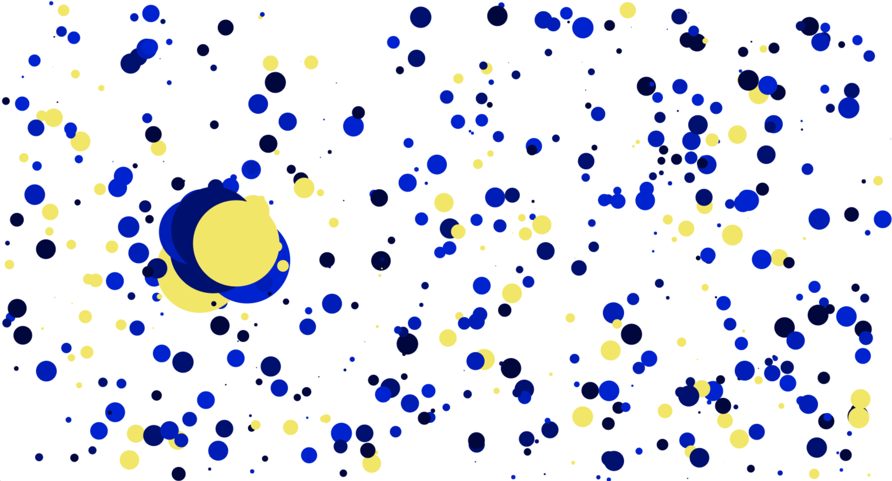
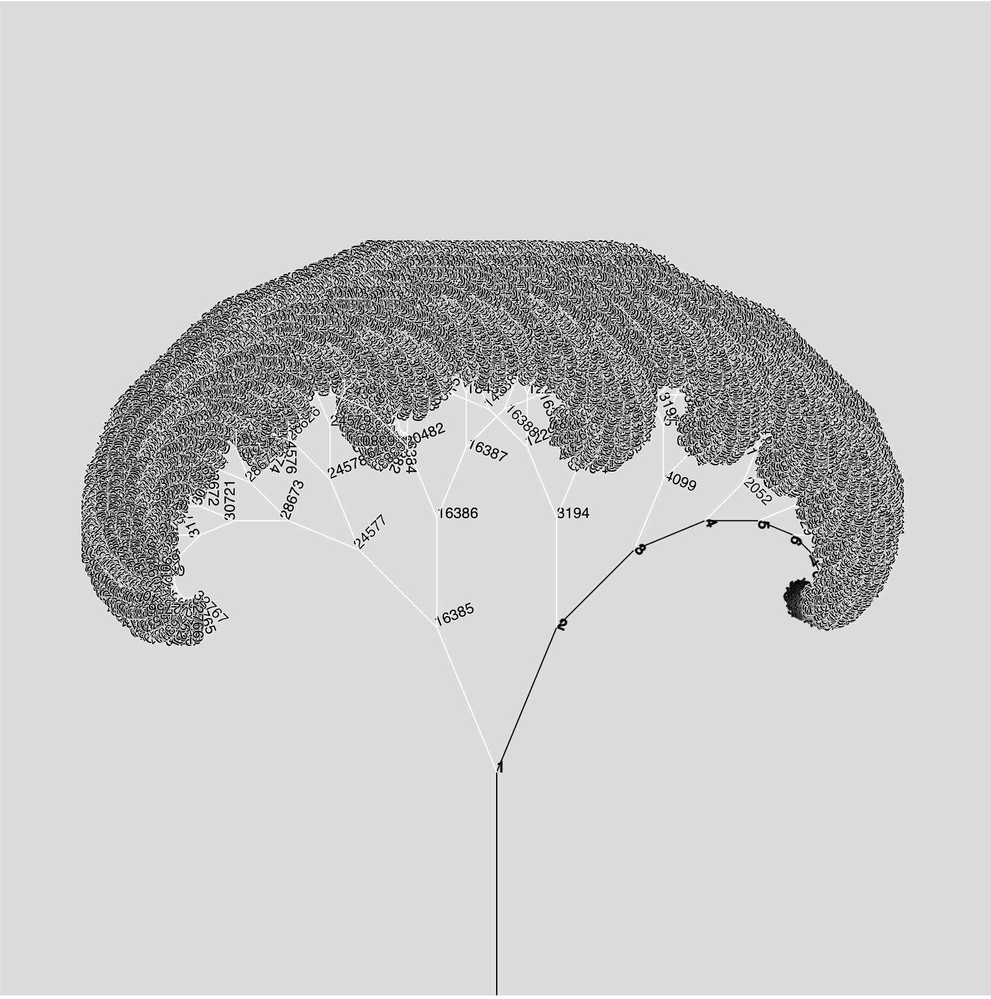

# play-with-canvas

## [dot](https://shinyiho.github.io/play-with-canvas/dots)

## [line](https://shinyiho.github.io/play-with-canvas/lines)

## [tree](https://shinyiho.github.io/play-with-canvas/tree)

